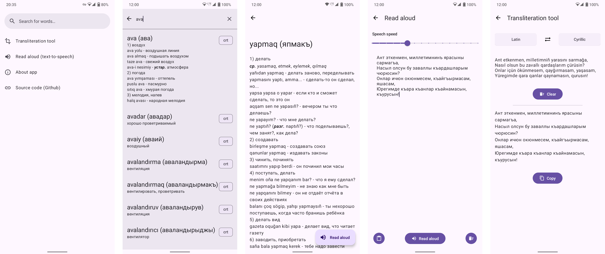

# Sesli Luğat
This is a Crimean Tatar-russian dictionary with text-to-speech capabilities.

---
[](http://www.amazon.com/gp/product/B0D4BN5QCN/ref=mas_pm_sesli_lugat)

---

## Features
- Words lookup in a digital version of the Crimean Tatar-russian dictionary by Seyran Memet oğlu Üseinov;
- Text-to-speech pronunciation of Crimean Tatar words and user-provided phrases. The model runs on-device and does not require an internet connection;
- A transliteration tool to convert between Cyrillic and Latin writing.

## Technologies
This project implements the Single-Activity Architecture and uses Android Architecture Components ([ViewModel](https://developer.android.com/topic/libraries/architecture/viewmodel), [Navigation & Safe Args](https://developer.android.com/guide/navigation)), [ViewBinding](https://developer.android.com/topic/libraries/view-binding), [RecyclerView](https://developer.android.com/develop/ui/views/layout/recyclerview), [Room](https://developer.android.com/training/data-storage/room), [Dagger/Hilt](https://dagger.dev/hilt/), [Material Components](https://github.com/material-components/material-components-android), Kotlin [Coroutines](https://kotlinlang.org/docs/coroutines-overview.html) and [Flows](https://kotlinlang.org/docs/flow.html), a TTS model from Facebook's [Massively Multilingual Speech project](https://huggingface.co/facebook/mms-tts-crh), and [sherpa-onnx](https://github.com/k2-fsa/sherpa-onnx) to run the model on-device.

## Building from sources locally
### Prerequisites
- The TTS model and the native libraries are stored in this repository using Git LFS. Before cloning the repo make sure that the LFS extension for Git is installed (it is included in the default Git installation for Windows). If those files are missing after cloning, run 
```
git lfs pull
```
to pull them.
### Debug APKs
- To create debug APKs run 
```
./gradlew assembleDebug
```
 in the project's root directory. The built APKs will be in `app/build/outputs/apk/debug/app-<cpu-architecture-or-universal>-debug.apk`.
### Release APKs / AAB
- For the release version you will need a keystore to sign the app. Place the keystore file at the root of the project under the name of `android-keystore.jks`.
- In the project's root folder create a file called `secrets.properties` with the following content:
```
SIGNATURE_KEYSTORE_PASSWORD=<password to the keystore you've provided>
SIGNATURE_KEY_ALIAS=<alias of the key from the keystore that you want to use to sign the app>
SIGNATURE_KEY_PASSWORD=<password to that key>
```
- To generate release APKs, run
```
./gradlew assembleRelease
```
The built APKs will be in `app/build/outputs/apk/release/app-<cpu-architecture-or-universal>-release.apk`.
- To create the AAB, run
```
./gradlew bundleRelease
```
The bundle will be in `app/build/outputs/bundle/release/app-release.aab`.

## Building with Github Actions
If you fork this repository, you can use Github Actions to build and publish the release vesrion of your fork.
- In your fork of add the following repository secrets:
  - `SIGNATURE_KEYSTORE_BASE64` - your keystore file encoded in base64;
  - `SIGNATURE_KEYSTORE_PASSWORD` - the password to the key in the keystore that you want to use for signing the app.
- Add a repository variable with the following name and value:
  - `SIGNATURE_KEY_ALIAS` - the alias of the key that you want to use.
- Run the "Build Release APKs and AAB" workflow.
- When the workflow job finishes, the APKs and the AAB will be available as its artifacts. A draft release will also be created and the files will be attached to it.

## Screenshots


## License
This project is licensed under the [GNU General Public License v3](LICENSE).